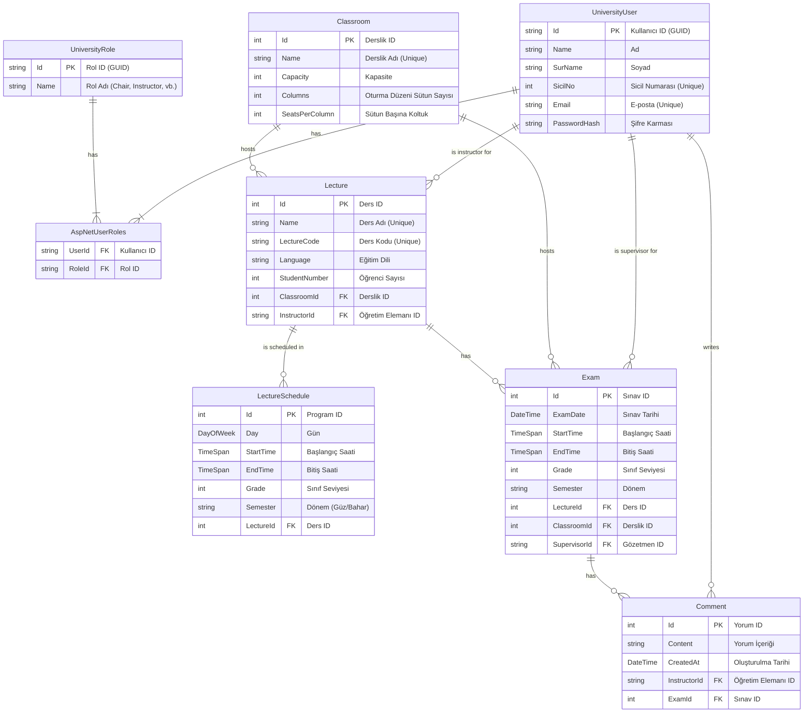

-----

# Üniversite Bölüm Yönetim Sistemi

Bu proje, bir üniversite bölümünün akademik ve idari operasyonlarını dijitalleştirmek, otomatize etmek ve verimliliği artırmak amacıyla geliştirilmiş, modern ve kapsamlı bir web uygulamasıdır. **ASP.NET Core 8 Web API** ve **React** teknolojileri üzerine inşa edilen bu sistem, ders programlarından sınav organizasyonuna, akademik personel yönetiminden derslik planlamasına kadar geniş bir yelpazede çözümler sunar.

Sistem, rol tabanlı erişim kontrolü sayesinde farklı yetkilere sahip kullanıcıların (Bölüm Başkanı, Bölüm Sekreteri ve Öğretim Elemanı) sadece kendi sorumluluk alanlarına giren işlemleri yapabilmesini sağlayarak veri güvenliğini ve iş akışı düzenini temin eder.
##  Kurulum ve Çalıştırma

### Ön Gereksinimler

  - [.NET 8.0 SDK](https://dotnet.microsoft.com/en-us/download/dotnet/8.0)
  - [Node.js](https://nodejs.org/) (v16 veya üstü)
  - Bir kod düzenleyici (Visual Studio, VS Code vb.)

### Adımlar

1.  **Projeyi Klonlayın:**

    ```bash
    gh repo clone keremkartal/UniversityDepartmentManagement
    cd UniversityDepartmentManagement
    ```

2.  **Backend'i Çalıştırın:**

      - `UniversityDepartmentManagement.sln` dosyasını Visual Studio ile açın.
      - Proje bağımlılıklarının otomatik olarak yüklenmesini bekleyin.
      - `UniversityDepartmentManagement.Server` projesini başlangıç projesi olarak ayarlayın ve çalıştırın (F5).
      - Bu işlem, veritabanını oluşturacak, `DataSeeder` ile başlangıç verilerini (roller ve varsayılan kullanıcılar) ekleyecek ve API'yi ayağa kaldıracaktır.

3.  **Frontend'i Çalıştırın:**

      - Projenin ana dizininde bir terminal açın ve frontend bağımlılıklarını yükleyin:
        ```bash
        npm install
        ```
      - Bağımlılıklar yüklendikten sonra geliştirme sunucusunu başlatın:
        ```bash
        npm run dev
        ```
      - Tarayıcınızda `https://localhost:50230` (veya terminalde belirtilen port) adresine gidin. Frontend, backend API'si ile otomatik olarak iletişim kuracaktır.

##  Mimari ve Teknoloji Stack'i

Proje, güncel yazılım geliştirme standartlarına uygun olarak, birbirinden bağımsız çalışabilen **istemci-sunucu (client-server)** mimarisiyle tasarlanmıştır.

### **Backend Mimarisi (`UniversityDepartmentManagement.Server`)**

Arka uç, .NET 8 üzerinde çalışan ve RESTful prensiplerine uygun bir API sunucusudur. Katmanlı mimari prensipleri benimsenmiştir:

  - **Presentation Katmanı (Controllers):** İstemciden gelen HTTP isteklerini karşılar, gerekli servisleri çağırır ve sonuçları HTTP yanıtı olarak döndürür. `UserManagementController`, `LectureController`, `ExamManagementController` gibi denetleyiciler bu katmanda yer alır.
  - **Business/Logic Katmanı:** Uygulamanın iş kuralları bu katmanda yer alır. Veritabanı işlemleri ve diğer servislerle etkileşim bu katman üzerinden yönetilir.
  - **Data Access Katmanı (DAL):** **Entity Framework Core** ve **Code-First** yaklaşımı ile veritabanı operasyonlarını yönetir. `DataApplicationContext` sınıfı, veritabanı tablolarını ve ilişkilerini tanımlar.
  - **Kimlik Doğrulama & Yetkilendirme:** **ASP.NET Core Identity** framework'ü ile kullanıcı ve rol yönetimi sağlanırken, API güvenliği **JWT (JSON Web Token)** ile temin edilir.

| Teknoloji/Kütüphane                                   | Amaç                                                                    |
| ----------------------------------------------------- | ----------------------------------------------------------------------- |
| **ASP.NET Core 8.0 Web API** | Güçlü ve performanslı API sunucusu oluşturma                            |
| **Entity Framework Core & SQLite** | Veritabanı işlemleri (ORM) ve yerel veritabanı çözümü                   |
| **ASP.NET Core Identity** | Kullanıcı kimlik doğrulama, rol ve yetki yönetimi                       |
| **JWT Bearer Authentication** | Güvenli ve stateless API kimlik doğrulaması                             |
| **Swagger/OpenAPI** | API dokümantasyonu ve testi                                             |

### **Frontend Mimarisi (`universitydepartmentmanagement.client`)**

Ön uç, **Vite** ile oluşturulmuş modern bir **React** uygulamasıdır. Bileşen tabanlı mimari sayesinde modüler, yeniden kullanılabilir ve bakımı kolay bir yapı hedeflenmiştir.

  - **Component-Based Architecture:** Her bir sayfa ve işlevsellik, kendi içinde mantığını ve görünümünü barındıran bileşenlerden (örn. `UserManagement.jsx`, `LectureList.jsx`) oluşur.
  - **State Management:** Kullanıcı oturum bilgileri gibi global durumlar için **React Context API** (`AuthContext`) kullanılmıştır.
  - **Routing:** Sayfalar arası geçişler ve URL yönetimi **React Router DOM** ile sağlanır.
  - **API İletişimi:** Backend API'si ile HTTP istekleri **Axios** kütüphanesi aracılığıyla yönetilir.

| Teknoloji/Kütüphane           | Amaç                                                        |
| ----------------------------- | ----------------------------------------------------------- |
| **React** | Modern, bileşen tabanlı kullanıcı arayüzleri oluşturma      |
| **Vite** | Hızlı ve verimli geliştirme sunucusu ve derleme aracı       |
| **React Router DOM** | İstemci tarafı yönlendirme (routing) yönetimi               |
| **Axios** | API isteklerini yönetmek için kullanılan HTTP istemcisi     |
| **React-Bootstrap & PrimeReact** | Hızlı ve tutarlı arayüz bileşenleri oluşturma               |
| **Framer Motion** | Akıcı ve modern animasyonlar                                |
| **SASS/CSS Modules** | Stil yönetimi ve modüler CSS                                |

##  Modüller ve Özellikler

### 1\. Kullanıcı Yönetim Modülü (`/user-management`)

Bölüm Başkanı ve Bölüm Sekreteri tarafından erişilebilir.

  - **Kullanıcı Ekleme:** Yeni akademik/idari personel kaydı oluşturma (Ad, Soyad, E-posta, Sicil No, Şifre).
  - **Rol Atama:** Yeni kullanıcılara `Instructor`, `Department Secretary` veya `Chair` rollerinden birini atama.
  - **Listeleme ve Arama:** Tüm kullanıcıları listeleme ve anlık arama ile filtreleme.
  - **Güncelleme ve Silme:** Mevcut kullanıcıların bilgilerini düzenleme ve sistemden silme.

### 2\. Ders ve Derslik Yönetim Modülü (`/lecture-list`, `/classroom-management`)

Bölüm Başkanı ve Bölüm Sekreteri tarafından erişilebilir.

  - **Derslik Yönetimi:**
      - Yeni derslik ekleme, mevcutları düzenleme ve silme.
      - Derslik kapasitesi, adı ve **oturma düzeni** (sıra ve sütun sayısı) gibi bilgileri yönetme.
      - Dersliğe atanmış dersleri görüntüleme.
  - **Ders Yönetimi:**
      - Yeni ders ekleme, düzenleme ve silme (Ders Kodu, Adı, Dili, Öğrenci Sayısı).
      - Derse öğretim elemanı ve derslik ataması yapma.
      - **Kapasite Kontrolü:** Dersin öğrenci sayısına göre uygun derslikleri dinamik olarak filtreleme ve yetersiz kapasite durumunda kullanıcıyı uyarma.

### 3\. Ders Programı Yönetim Modülü (`/management-schedule`)

Bölüm Başkanı ve Bölüm Sekreteri tarafından erişilebilir.

  - **Haftalık Program Görünümü:** Dersleri haftalık takvim üzerinde (Pazartesi-Cuma, 08:00-17:00) görsel olarak planlama.
  - **Filtreleme:** Sınıf seviyesi (1-4) ve döneme (Güz/Bahar) göre ders programlarını filtreleme.
  - **Çakışma Kontrolü:** Yeni bir ders eklenirken, aynı saatte aynı dersliğin veya aynı öğretim elemanının başka bir derste olup olmadığını kontrol ederek çakışmaları önleme.
  - **Sürükle-Bırak Arayüzü (Planlanan):** Dersleri program üzerinde kolayca taşımak için sürükle-bırak işlevselliği.

### 4\. Sınav Yönetim Modülü (`/exam-management`)

Tüm roller tarafından erişilebilir, yetkiye göre işlevler kısıtlıdır.

  - **Sınav Planlama:** Sınavlar için tarih, saat, derslik ve gözetmen ataması yapma.
  - **Çakışma Önleme:** Sınav planlaması sırasında derslik ve gözetmen çakışmalarını otomatik olarak kontrol etme.
  - **Yorum Sistemi:** Öğretim elemanlarının sınavlar hakkında notlar veya yorumlar ekleyebilmesi.

##  Veritabanı Şeması ve İlişkileri

Entity Framework Core Code-First yaklaşımı ile tasarlanan veritabanı şeması, sistemin temelini oluşturur. Varlıklar arasındaki ilişkiler, akademik süreçlerin bütünlüğünü sağlar.



##  Proje Yapısı

Proje, `Server` ve `Client` olmak üzere iki ana klasörden oluşur.

```
/UniversityDepartmentManagement
├── UniversityDepartmentManagement.Server/  # ASP.NET Core Backend Projesi
│   ├── Controllers/                        # API endpoint'leri
│   ├── Data/                               # DbContext, Seeder ve Identity sınıfları
│   ├── Entities/                           # Veritabanı varlıkları (modeller)
│   ├── Migrations/                         # EF Core veritabanı geçişleri
│   ├── Models/                             # DTO (Data Transfer Objects)
│   ├── Properties/                         # Proje ayarları (launchSettings.json)
│   ├── Program.cs                          # Uygulama başlangıç ve konfigürasyon dosyası
│   └── appsettings.json                    # Konfigürasyon (veritabanı, JWT vb.)
│
└── universitydepartmentmanagement.client/    # React Frontend Projesi
    ├── public/                             # Statik dosyalar
    └── src/                                # React uygulama kaynak kodları
        ├── Components/                     # Yeniden kullanılabilir React bileşenleri
        ├── Contexts/                       # React Context API (AuthContext)
        ├── CSS/                            # Stil dosyaları
        ├── App.jsx                         # Ana uygulama bileşeni ve yönlendirme
        ├── main.jsx                        # Uygulama giriş noktası
        └── vite.config.js                  # Vite konfigürasyon dosyası
```


